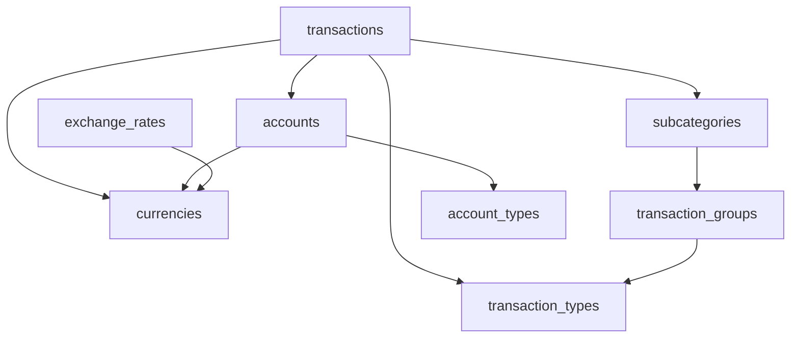

# Accounting System Data Structure Documentation

## Overview
This document provides a comprehensive overview of the data structure used in the personal finance accounting application. The system uses an Excel-based relational database structure for storing financial data with full CRUD operations and relationships between tables.

---

## 📋 Table of Contents
1. [Core Architecture](#core-architecture)
2. [Database Tables Overview](#database-tables-overview)
3. [Transaction Classification Hierarchy](#transaction-classification-hierarchy)
4. [Account Management](#account-management)
5. [Currency System](#currency-system)
6. [Relationships and Foreign Keys](#relationships-and-foreign-keys)
7. [Data Flow Examples](#data-flow-examples)

---

## 🏗️ Core Architecture

### Database Engine
- **Type**: Excel-based relational database (.xlsx files)
- **Location**: User-selected folder with individual Excel files per table
- **Engine**: `RelationalDatabase.js` - Custom implementation
- **File Manager**: `RelationalFileStorage.js` - Handles Excel file operations

### Storage Pattern
```
Database Folder/
├── accounts.xlsx
├── transactions.xlsx
├── transaction_types.xlsx
├── transaction_groups.xlsx
├── subcategories.xlsx
├── currencies.xlsx
├── exchange_rates.xlsx
├── payees.xlsx
├── payers.xlsx
└── [other tables].xlsx
```

---

## 📊 Database Tables Overview

### Core Financial Tables

| Table Name | Purpose | Key Fields |
|------------|---------|------------|
| `accounts` | Bank accounts, cash, investments | id, name, accountCode, balance, currencyId |
| `transactions` | All financial transactions | id, date, amount, accountId, categoryId, subcategoryId |
| `transaction_types` | Top-level categories | id, name, description, color, icon |
| `transaction_groups` | Mid-level groupings | id, name, transactionTypeId, color |
| `subcategories` | Specific transaction types | id, name, groupId, description |

### Supporting Tables

| Table Name | Purpose | Key Fields |
|------------|---------|------------|
| `currencies` | Currency definitions | id, name, symbol, code, exchangeRateToBase |
| `exchange_rates` | Currency conversion rates | id, fromCurrencyId, toCurrencyId, rate, date |
| `payees` | Transaction recipients | id, name, description |
| `payers` | Transaction senders | id, name, description |
| `tags` | Transaction tags/labels | id, name, description |

### System Tables

| Table Name | Purpose | Key Fields |
|------------|---------|------------|
| `database_info` | System metadata | id, key, value |
| `user_preferences` | User settings | id, category, key, value |
| `bank_configurations` | Import settings | id, name, type, fieldMapping |
| `processing_rules` | Auto-categorization | id, name, conditions, actions |

---

## 🏷️ Transaction Classification Hierarchy

The system uses a **3-level hierarchical structure** for organizing transactions:

### Hierarchy Structure
```
Transaction Types (Level 1)
    └── Transaction Groups (Level 2)
        └── Subcategories (Level 3)
```

### Level 1: Transaction Types (`transaction_types`)
**Purpose**: Fundamental classification of money flow

| ID | Name | Description | Icon | Color |
|----|----|-------------|------|-------|
| CAT_001 | Income | Money coming in | 💰 | #4CAF50 |
| CAT_002 | Expenses | Money going out | 💸 | #F44336 |
| CAT_003 | Transfer | Money movement between accounts | 🔄 | #2196F3 |
| CAT_004 | Investment - SELL | Investment selling | 📈 | #9C27B0 |
| CAT_005 | Investment - BUY | Investment purchase | 📈 | #9C27B0 |

### Level 2: Transaction Groups (`transaction_groups`)
**Purpose**: Logical groupings within each transaction type

| ID | Name | Transaction Type | Description |
|----|------|------------------|-------------|
| GRP_001 | Essential Expenses | Expenses | Housing, food, utilities, insurance |
| GRP_002 | Lifestyle & Recreation | Expenses | Entertainment, dining, travel, hobbies |
| GRP_003 | Professional & Business | Income | Salary, freelance, business revenue |
| GRP_004 | Investment & Savings | Income/Investment | Investment returns, savings |
| GRP_005 | Bank Transfer | Transfer | Account transfers, wire transfers |
| GRP_006 | Digital Assets Selling | Investment - SELL | Crypto, digital asset sales |
| GRP_007 | Digital Assets Purchase | Investment - BUY | Crypto, digital asset purchases |

### Level 3: Subcategories (`subcategories`)
**Purpose**: Specific transaction categories for detailed tracking

#### Essential Expenses (GRP_001)
- SUB_001: Groceries & Food
- SUB_002: Housing & Utilities  
- SUB_003: Transportation & Fuel
- SUB_004: Healthcare & Medical
- SUB_005: Insurance Premiums
- SUB_006: Debt Payments

#### Lifestyle & Recreation (GRP_002)
- SUB_007: Dining Out & Restaurants
- SUB_008: Entertainment & Movies
- SUB_009: Travel & Vacation
- SUB_010: Hobbies & Sports
- SUB_011: Shopping & Personal Items
- SUB_012: Subscriptions & Memberships

#### Professional & Business (GRP_003)
- SUB_013: Salary & Wages
- SUB_014: Freelance & Consulting
- SUB_015: Business Revenue
- SUB_016: Bonuses & Commissions
- SUB_017: Professional Services Income

#### Investment & Savings (GRP_004)
- SUB_018: Stock Investments
- SUB_019: Bond Investments
- SUB_020: Real Estate Investment
- SUB_021: Retirement Savings
- SUB_022: Emergency Fund
- SUB_023: Investment Returns

#### Bank Transfer (GRP_005)
- SUB_024: Account to Account Transfer
- SUB_025: External Bank Transfer
- SUB_026: Wire Transfers
- SUB_027: ATM Transfers

#### Digital Assets (GRP_006/007)
- SUB_028: Bitcoin Investment
- SUB_029: Ethereum Investment
- SUB_030: Altcoin Investment
- SUB_031: Crypto Trading
- SUB_032: DeFi & Staking
- SUB_033: Bitcoin Selling
- SUB_034: Ethereum Selling

---

## 💳 Account Management

### Account Structure (`accounts`)
```javascript
{
  id: 'ACC001',
  name: 'Default Account',
  accountCode: 'DA',              // 2-3 character identifier
  accountTypeId: 'ACCT_TYPE_001', // Links to account_types
  balance: 0,                     // Current balance
  initialBalance: 0,              // Starting balance
  currencyId: 'CUR_001',          // Links to currencies
  description: 'Cash on hand',
  includeInOverview: true,        // Show in dashboard
  isActive: true,
  createdAt: '2025-01-01T00:00:00Z'
}
```

### Account Types
| ID | Type | Subtype | Examples |
|----|------|---------|----------|
| ACCT_TYPE_001 | Asset | Bank account | Checking, Savings |
| ACCT_TYPE_002 | Asset | Investment account | Stocks, Bonds, 401k |
| ACCT_TYPE_003 | Asset | Fixed Assets | Real Estate, Vehicles |
| ACCT_TYPE_004 | Liability | Credit | Credit Cards, Loans |
| ACCT_TYPE_005 | Liability | Long-term Debt | Mortgage, Car Loans |

---

## 💰 Currency System

### Currency Structure (`currencies`)
```javascript
{
  id: 'CUR_001',
  name: 'Euro',
  symbol: '€',
  code: 'EUR',
  type: 'fiat',                    // fiat, crypto
  decimalPlaces: 2,
  exchangeRateToBase: 1.0,         // Rate to base currency
  isBaseCurrency: true,
  isActive: true,
  createdAt: '2025-01-01T00:00:00Z'
}
```

### Supported Currencies
| ID | Name | Symbol | Code | Type |
|----|------|--------|------|------|
| CUR_001 | Euro | € | EUR | fiat |
| CUR_002 | US Dollar | $ | USD | fiat |
| CUR_003 | British Pound | £ | GBP | fiat |
| CUR_004 | Japanese Yen | ¥ | JPY | fiat |
| CUR_005 | Canadian Dollar | C$ | CAD | fiat |
| CUR_006 | Australian Dollar | A$ | AUD | fiat |
| CUR_007 | UAE Dirham | د.إ | AED | fiat |
| CUR_008 | Swiss Franc | CHF | CHF | fiat |

### Exchange Rate System
- Real-time exchange rate fetching
- Historical rate storage
- Multi-currency transaction support
- Automatic conversion for reporting

---

## 🔗 Relationships and Foreign Keys

### Primary Relationships


### Foreign Key Constraints
| Child Table | Foreign Key | Parent Table | Parent Field |
|-------------|-------------|--------------|--------------|
| transactions | accountId | accounts | id |
| transactions | categoryId | transaction_types | id |
| transactions | subcategoryId | subcategories | id |
| transactions | currencyId | currencies | id |
| transaction_groups | transactionTypeId | transaction_types | id |
| subcategories | groupId | transaction_groups | id |
| accounts | currencyId | currencies | id |
| exchange_rates | fromCurrencyId | currencies | id |
| exchange_rates | toCurrencyId | currencies | id |

---

## 📈 Data Flow Examples

### Example 1: Creating a Restaurant Expense
1. **User Input**: "Dinner at Italian restaurant - $45.50"
2. **Data Flow**:
   ```javascript
   // Transaction creation
   {
     id: 'TXN_001',
     date: '2025-01-09',
     description: 'Dinner at Italian restaurant',
     amount: 45.50,
     accountId: 'ACC001',           // Default Account
     categoryId: 'CAT_002',         // Expenses
     subcategoryId: 'SUB_007',      // Dining Out & Restaurants
     currencyId: 'CUR_002',         // USD
     transactionType: 'DEBIT'
   }
   ```
3. **Hierarchy Resolution**:
   - Transaction Type: Expenses (CAT_002)
   - Transaction Group: Lifestyle & Recreation (GRP_002) 
   - Subcategory: Dining Out & Restaurants (SUB_007)

### Example 2: Salary Income
1. **User Input**: "Monthly salary - €3,500"
2. **Data Flow**:
   ```javascript
   {
     id: 'TXN_002',
     date: '2025-01-01',
     description: 'Monthly salary',
     amount: 3500.00,
     accountId: 'ACC001',           // Default Account
     categoryId: 'CAT_001',         // Income
     subcategoryId: 'SUB_013',      // Salary & Wages
     currencyId: 'CUR_001',         // EUR
     transactionType: 'CREDIT'
   }
   ```

### Example 3: Multi-Currency Investment
1. **User Input**: "Bitcoin purchase - $1,000"
2. **Data Flow**:
   ```javascript
   {
     id: 'TXN_003',
     date: '2025-01-05',
     description: 'Bitcoin purchase',
     amount: 1000.00,
     accountId: 'ACC001',           // Default Account (EUR)
     categoryId: 'CAT_005',         // Investment - BUY
     subcategoryId: 'SUB_028',      // Bitcoin Investment
     currencyId: 'CUR_002',         // USD (transaction currency)
     exchangeRate: 0.85,            // USD to EUR rate
     transactionType: 'DEBIT'
   }
   ```
3. **Currency Conversion**: System automatically converts USD to EUR for account balance updates

---

## 🛠️ Technical Implementation Notes

### Data Validation
- Foreign key validation on all relationships
- Required field validation
- Data type validation (dates, numbers, currencies)
- Business rule validation (positive amounts, valid accounts)

### Performance Optimizations
- In-memory table loading for fast queries
- Indexed lookups for foreign keys
- Lazy loading of large datasets
- Efficient Excel file operations

### Backup and Recovery
- Each table stored as individual Excel file
- Full database export capabilities
- Import/export with data validation
- Version control through file timestamps

### Multi-language Support
- English and French language packs
- Localized transaction categories
- Currency formatting per locale
- Date formatting per region

---

## 📝 Usage Guidelines

### Adding New Transaction Types
1. Add entry to `transaction_types` table
2. Create corresponding `transaction_groups`
3. Define specific `subcategories`
4. Update UI category selection components
5. Test data flow end-to-end

### Account Setup Best Practices
1. Use descriptive account names
2. Set appropriate account codes (2-3 chars)
3. Link to correct currency
4. Set proper account type classification
5. Initialize with accurate starting balance

### Currency Configuration
1. Set one currency as base (usually local currency)
2. Configure exchange rate sources
3. Set up automatic rate updates
4. Test multi-currency transaction flows

---

**Document Version**: 1.0  
**Last Updated**: January 9, 2025  
**Related Files**: 
- `src/utils/relationalDatabase.js` - Core database logic
- `src/utils/relationalFileStorage.js` - File management
- `MIGRATION_LOCALSTORAGE_TO_DATABASE.md` - Migration guide